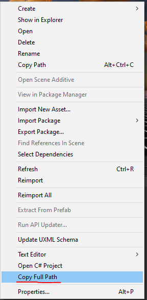

# Copy Full Path Unity
Copy the code or download the script and put it in the "Editor" folder.



```
https://github.com/ARtronClassicStudio/com.unity.copyfullpath.git
```

```C#
using System.IO;
using UnityEditor;
using UnityEngine;

internal class CopyFullPath : Editor
{
    [MenuItem("Assets/Copy Full Path &c")]
    internal static void Copy()
    {
        GUIUtility.systemCopyBuffer = Path.GetFullPath(AssetDatabase.GetAssetPath(Selection.activeObject));        
    }
}
```
