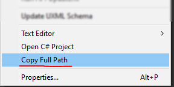

# Copy Full Path Unity
1. Copy the code or download the script and put it in the "Editor" folder.




```C#
using System.IO;
using UnityEditor;
using UnityEngine;

internal class CopyFullPath : Editor
{
    [MenuItem("Assets/Copy Full Path")]
    internal static void Copy()
    {
        GUIUtility.systemCopyBuffer = Path.GetFullPath(AssetDatabase.GetAssetPath(Selection.activeObject));        
    }
}
```
